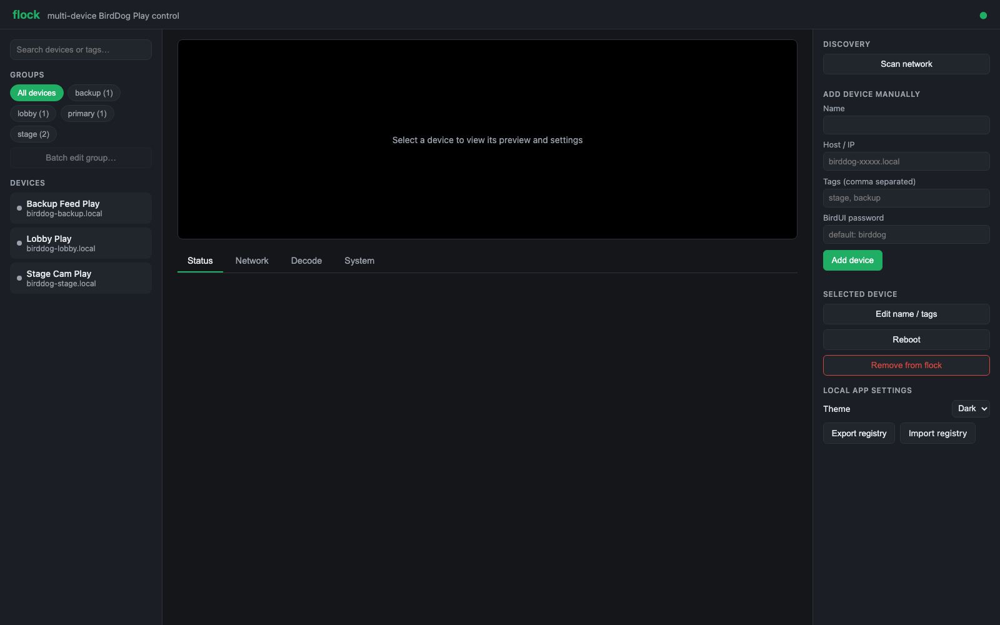
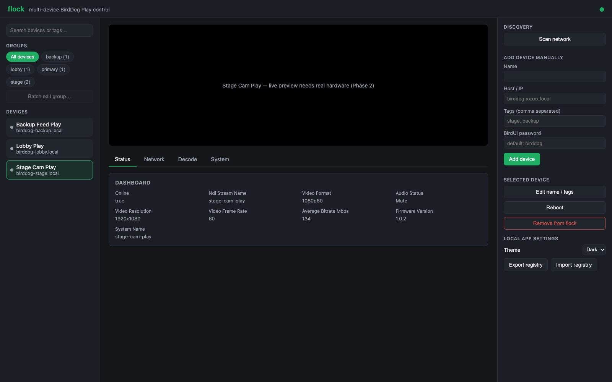
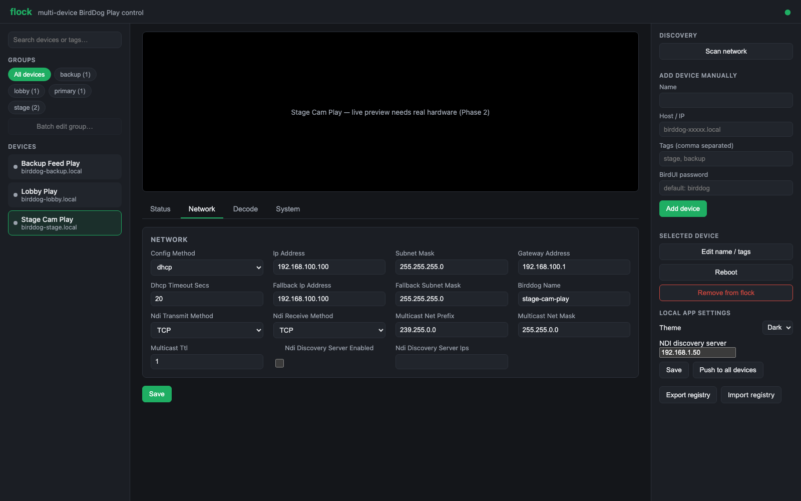
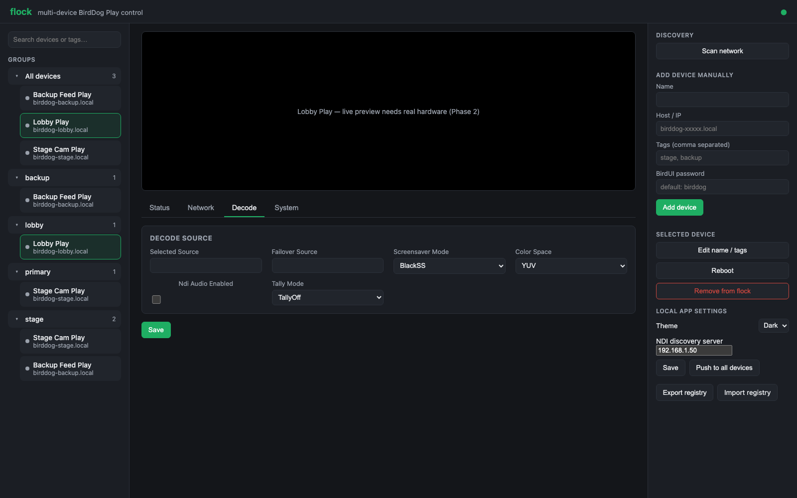
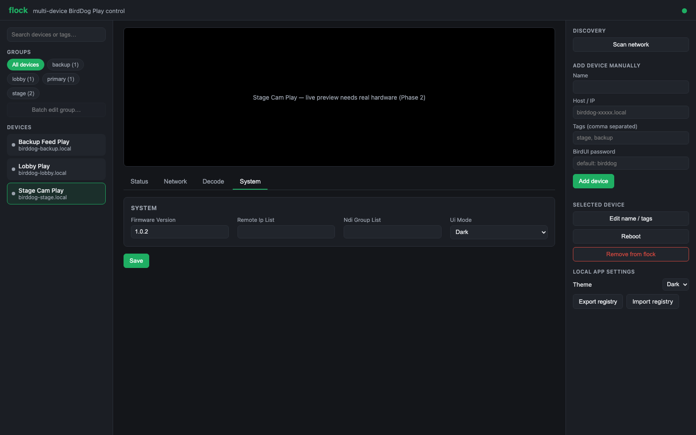
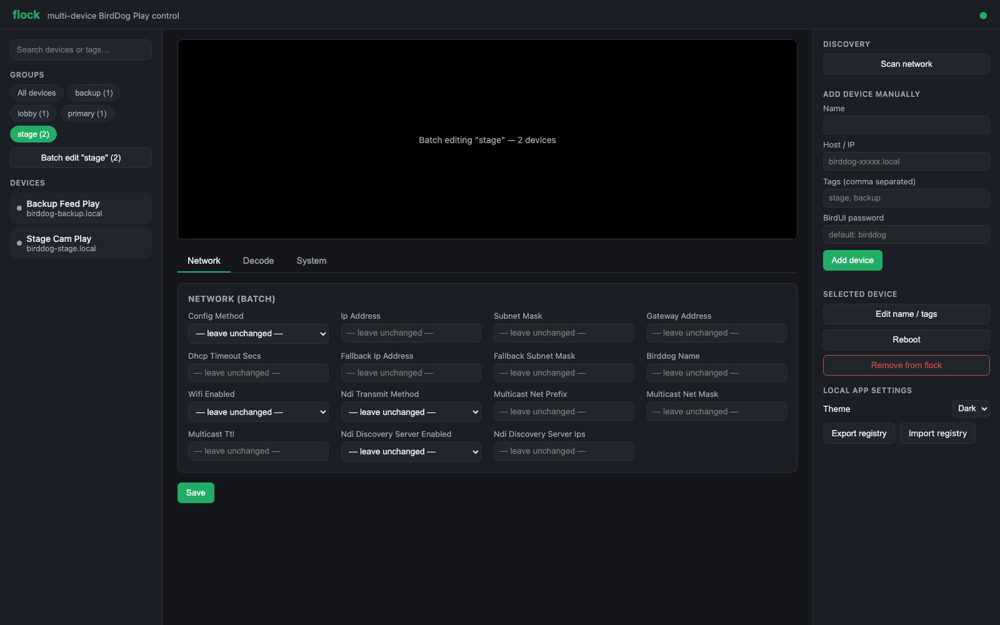
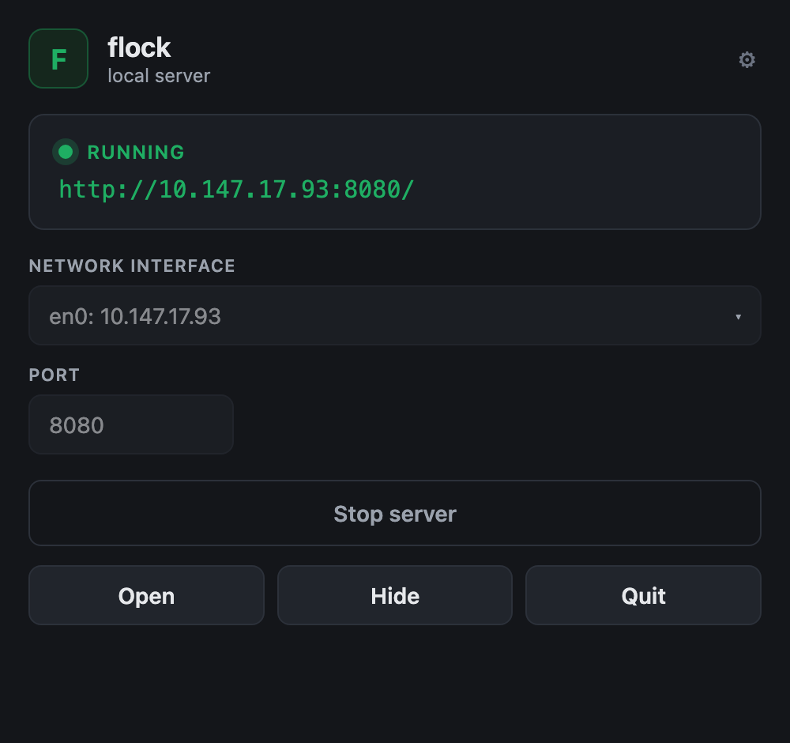
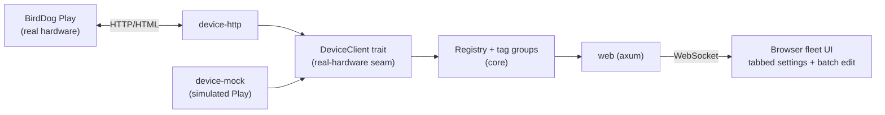

# flock

> **AI-assisted project.** This codebase was created with
> [Claude](https://claude.com/claude-code) (Anthropic), directed and
> reviewed by a human author. Treat this as an early-stage hobby project:
> it's been exercised end-to-end against both a simulated BirdDog Play
> device and a real one — including live reads and a real settings write
> (routing an actual NDI source to a physical unit's HDMI output) — see
> [Status](#status) below for exactly what that covers and what's still
> unverified.

A single web UI for managing any number of [BirdDog Play](https://birddog.tv/play-overview/)
NDI/SRT decoders — a fleet control panel for devices that otherwise only
have their own individual [BirdUI](https://birddog.tv/birdui-overview/) web
interface. Discover Play units on the LAN or add them manually, tag each
into (multiple) groups, see/change every BirdUI setting for a selected
device from one un-nested, tabbed view, or push a setting to an entire
group at once.

## Screenshots

*Real screenshots of flock running locally against the three seeded
`device-mock` devices (see [Status](#status)) — not mockups.*

**Overview** — a nested group tree on the left (a device can sit in more
than one group, and appears under each), preview + settings in the center,
discovery/add/local settings on the right:



**Status** tab — the per-device dashboard:



**Network** tab — IP config, NDI transmit/receive preferred method,
multicast, and discovery server settings, all in one flat panel:



**Decode** tab — NDI or SRT source selection (toggled per-device),
failover, screensaver, colour space, NDI audio, and tally (Play is
decode-only, so there is no Encode tab). SRT support is new — see
[Status](#status) for what's confirmed against real hardware vs. still a
best guess:



**System** tab — firmware version and Access Manager lists:



**Batch edit** — groups are a nested tree in the left panel; click a
group's header to batch-edit every member at once, or expand it to drill
into an individual device. Every field starts blank/"leave unchanged"; only
fields you actually fill in are sent, merged into each member device's own
current settings rather than overwriting the whole group with a shared
template:



## What it does

- **Device registry**: any number of BirdDog Play devices, each taggable
  into multiple groups (a device isn't locked to one group).
- **Discovery**: an active LAN subnet probe (the actual way a real Play is
  found — it doesn't advertise itself over mDNS at all), manual add-by-host
  as a fallback that always works, and a *separate*, centralized NDI source
  list (mDNS) that suggests values in the Decode tab — flock discovers NDI
  sources once, itself, instead of each Play searching independently, the
  same control-plane-only model real NDI routers (BirdDog's own Keyboard,
  Vizrt's NDI Router) use — see [docs/architecture.md](docs/architecture.md).
- **Full BirdUI parity for Play** (decode-only, so no Encode tab): Status
  (Dashboard), Network, Decode (NDI source + failover, or SRT — caller/
  listener, stream name, IP/port, latency, encryption), and System
  (password/firmware/Access Manager/UI mode) — every field visible directly
  in its tab, nothing behind a submenu.
- **Nested groups, one click to batch-edit**: groups are a vertical tree in
  the left panel (a device can sit in more than one, appearing under each);
  click a group's header to apply a Network/Decode/System change to every
  member at once, or expand it to drill into an individual device. Blank
  fields mean "leave unchanged" — a batch save merges into each device's own
  current settings rather than clobbering the whole group with one shared
  template.
- **NDI Discovery Server, fleet-wide**: set it once in Local App Settings and
  push it to every registered Play's own Network settings in one click
  (flock can't itself query a Discovery Server — no public protocol spec —
  but every Play can, so this configures them to).
- **Live updates**: a WebSocket pushes registry/status changes to every open
  browser tab.
- **Runs in Docker**: `docker compose up` — see the networking note below.

## Status

**Phase 2 (current): validated against both a simulated and a real BirdDog
PLAY.** `crates/device-mock` stands in for hardware for quick iteration/demo;
`crates/device-http` is a real client confirmed against an actual PLAY unit
(firmware 1.0.18) — see [docs/architecture.md](docs/architecture.md)'s
"Confirmed against real hardware" section for exactly what that means and
its known limitations.

Working:
- Cargo workspace (`core`/`discovery`/`device-mock`/`device-http`/`web`/
  `flock`), `cargo build`/`clippy`/`test` all clean, including offline unit
  tests for the real HTML scraper against fixtures captured from actual
  hardware
- Three-pane UI: device list + tag-derived groups on the left, preview +
  tabbed settings in the center, discovery/add/remove/local settings on the
  right
- Every settings tab round-trips against the mock device, single-device or
  batched across a whole group
- Reads (`status`/`network_settings`/`decode_settings`) **and** a real
  settings write both verified live against physical hardware — routed an
  actual NDI source to a real Play's HDMI output through flock's own API,
  read the change back, switched it twice more. Along the way, found (by
  testing, not guessing) that the decode-source picker needed a separate
  JSON API on port 8080 and a specific button field the server silently
  ignores requests without — see [docs/architecture.md](docs/architecture.md)
- Subnet-probe + mDNS discovery scan + manual add/edit/remove
- `docker-compose.yml` with host networking (needed for the subnet probe and
  mDNS alike)
- Device passwords are encrypted at rest (AES-256-GCM, auto-generated key
  file) — `registry.json` itself never holds a plaintext password, and a
  pre-existing plaintext registry.json migrates transparently on its next
  save. See [docs/architecture.md](docs/architecture.md#credentials-are-encrypted-at-rest-transparently)
- SRT decode support (the operator's real Play gained this after a firmware
  update mid-development): switching a device between NDI/SRT source mode is
  confirmed working live, including the real HTML field names. Actually
  applying a manually-typed SRT connection is a separate mechanism (a JSON
  API on port 8080, reverse engineered from BirdUI's own JS) that's
  implemented but was observed unreliable (times out) in live testing —
  deliberately non-fatal, so it can never block the rest of a decode save —
  see [docs/architecture.md](docs/architecture.md#srt-decode-support---confirmed-live-apply-mechanism-partially-unreliable)
- Optional auth for flock itself — off by default (unchanged trusted-LAN
  behavior), but setting `admin_password` in `config/flock.toml` gates the
  whole UI/API behind a single shared login, with brute-force lockout on the
  login endpoint. See
  [docs/architecture.md](docs/architecture.md#flocks-own-auth-is-optional-off-by-default)

Not yet done:
- Live video preview is a placeholder (needs an actual NDI/SRT frame grab)
- Actually applying a manually-entered SRT source — see above, the real
  device-side mechanism hasn't behaved reliably in testing yet

## Quick start

```bash
cargo run -p flock
```

Then open `http://localhost:8080`. On first run with an empty registry it
seeds three demo devices so there's something to look at immediately.

### Docker

```bash
docker compose up --build
```

Uses `network_mode: host` so both discovery mechanisms (the subnet probe and
mDNS) can reach the LAN from inside the container — see
[docs/architecture.md](docs/architecture.md#docker--networking) for the
tradeoff and the bridge-networking alternative if you'd rather keep
container isolation and rely on manual add only.

### Desktop app

Prefer not to touch the terminal? A small menu-bar app lets you pick the network
interface + port, Start/Stop the server, and open the web UI. The `flock` server
is bundled inside, so it's a single download — nothing to install or wire up.
Grab the `.dmg` from [Releases](https://github.com/allansargeant/flock/releases),
or see [launcher/](launcher/) to build it.

<p align="center"></p>

## Architecture



See [docs/architecture.md](docs/architecture.md) for the crate layout, the
`DeviceClient` trait that isolates real-hardware integration to one seam,
and the full list of what's confirmed against real hardware vs. still
unconfirmed/unimplemented.

## Unsigned builds — macOS Gatekeeper & Windows SmartScreen

The release binaries are **not code-signed or notarized** — that needs paid
Apple / Windows developer certificates this project doesn't carry. The binaries
are safe to run; the OS just can't verify a publisher, so it warns you the first
time. Here's how to get past that, and how to sign them yourself if you'd rather.

### macOS

These are command-line binaries, so clear the quarantine flag in Terminal. After
extracting the archive, `cd` into it and run:

```sh
xattr -dr com.apple.quarantine ./<binary>   # remove the "unverified developer" flag
chmod +x ./<binary>                          # ensure it's executable
./<binary> --help
```

Or run it once, let macOS block it, then go to **System Settings → Privacy &
Security** and click **Open Anyway**.

### Windows

Running the `.exe` may show **"Windows protected your PC"** (SmartScreen) — click
**More info → Run anyway**. If you extracted it from a `.zip`, you can clear the
flag first: right-click the `.exe` → **Properties** → tick **Unblock** → **OK**,
or in PowerShell `Unblock-File .\<binary>.exe`.

### Linux

No signing gate — just `chmod +x ./<binary>` (or install the `.deb`/`.rpm`).

### Signing it yourself (optional)

On macOS an *ad-hoc* signature stops repeated prompts on your own machine (it is
**not** notarization — it won't clear Gatekeeper on someone else's Mac):

```sh
codesign --force --sign - ./<binary>
```

Clearing the warnings for redistribution needs paid certificates: an **Apple
Developer Program** membership ($99/yr) + a *Developer ID Application* cert with
`xcrun notarytool` on macOS, or an **Authenticode** code-signing certificate from
a CA (`signtool sign`) on Windows.

## Roadmap / TODO

Full plan in [docs/roadmap.md](docs/roadmap.md). Next up:

- [ ] **Subscribe to the real device's live status WebSocket** instead of polling `/dashboard`.
- [ ] **Real live video preview** — an actual NDI/SRT frame grab (currently a placeholder).
